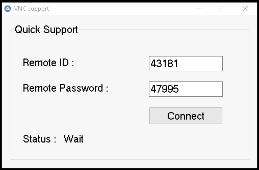

# vncsupport

[README.EN](https://github.com/andy03kr/vncsupport#readmeen)

[README.RU](https://github.com/andy03kr/vncsupport#readmeru)

VNCsupport



# README.EN
## About vncsupport
VNCsupport provides remote access to the user's desktop for technical support when one or both behinde NAT.

### Uses
- PLINK.EXE and PUTTYGEN.EXE from putty package - to create a secure connection to a proxy server and convert a private key.
- vncviewer.exe from UltraVNC package - for access to the desktop.
- 7zSD.sfx from the LZMA SDK package - to create an SFX archive.
- AutoIT - for run test and build.

## Requirements
- Windows computer with AutoIT installed for initial setup and testing
- Package [putty.zip](https://the.earth.li/~sgtatham/putty/latest/w32/putty.zip)
- Package [UltraVNC](https://www.uvnc.com/downloads/ultravnc/129-download-ultravnc-1231.html)
- Package [7zip](https://www.7-zip.org/download.html)
- Package [LZMA SDK](https://www.7-zip.org/sdk.html)

### Windows computer
Download and unpack the vncsupport archive.
Install AutoIT.
Unzip the putty archive to c:\putty and run PUTTYGEN.EXE

From [vncdesktop](https://github.com/andy03kr/vncdesktop) get the private key linux user and save in the local mochine.
In the "Conversions" - "Import Key" menu, import the id_rsa key - "Save private key" - save as vncproxy.ppk to the c:\vncsupport\bin\ directory

From [vncdesktop](https://github.com/andy03kr/vncdesktop) get the hostkey and add the line hostkey="24:b1:c4:9e:c9:b5:d6:e6:03:12:df:1f:64:dd:81:1d"
to the c:\vncsupport\bin\vncsupport.ini file

Parameters in vncsupport.ini file (default)
```html
 server = vncproxy.home.lan                                   #defines a proxy server (NONE)
 sshport = 22022                                              #the ssh port on proxy server (22022)
 vncport = 15900                                              #VNC port (15900)
 sshuser = vncproxy                                           #proxy server user (vncproxy)
 certificate = vncproxy.ppk                                   #private key file name (NONE)
 hostkey = "24:b1:c4:9e:c9:b5:d6:e6:03:f2:df:1f:64:dd:81:1d"  #proxy server fingerprint (NONE)
```
From the UltraVNC package you will need vncviewer.exe

Copy plink.exe and vncviewer.exe into c:\vncsupport\bin\ directory

On another computer, run vncdesktop.

Open the vncsupport.au3 file in SciTE Script Editor and press F5 to start the project. Then connect to computer with vncdesktop.

### Build

If you were able to connect without errors, you can build the project - in SciTE Script Editor open vncsupport.au3 and press F7.
Or use C:\Program Files (x86)\AutoIt3\Aut2Exe tool for convert vncsupport.au3 to vncsupport.exe and set your own icon.

Create an archive in the c:\vncsupport\build directory:
 > "c:\Program Files\7-Zip\7z.exe" a -r c:\vncsupport\build\vncsupport.7z c:\vncsupport\bin c:\vncsupport\vncsupport.exe

Copy 7zSD.sfx file in c:\vncsupport\build directory.

Create config.txt file in c:\vncsupport\build directory.
```html
 ;! @ Install @! UTF-8!
 Title = "vncsupport v1.0.0.0"
 RunProgram = "vncsupport.exe"
 ;! @ InstallEnd @!
```

Then, in the c:\vncsupport\build directory, run
 > copy / b 7zSD.sfx + config.txt + vncsupport.7z vncsupport.exe

### Run

On another computer, run vncdesktop.

Run c:\vncsupport\build\vncsupport.exe then connect to computer with vncdesktop.

# README.RU
## О vncsupport
Предоставляет удаленный доступ к рабочему столу пользователя для технической поддержки когда один или оба находятся за NAT.

### Использует
- PLINK.EXE и PUTTYGEN.EXE из пакета putty - для создания безопасного подключения к прокси серверу и конвертации приватного ключа.
- vncsupport.exe из пакета UltraVNC - для, непосредственно, доступа к рабочему столу.
- 7zSD.sfx из пакета LZMA SDK - для создания SFX-архива.
- AutoIT - для тестового запуска и сборки.

## Требования
- Windows компьютер с установленным AutoIT для первичной настройки и тестирования
- Пакет [putty.zip](https://the.earth.li/~sgtatham/putty/latest/w32/putty.zip)
- Пакет [UltraVNC](https://www.uvnc.com/downloads/ultravnc/129-download-ultravnc-1231.html)
- Пакет [7zip](https://www.7-zip.org/download.html)
- Пакет [LZMA SDK](https://www.7-zip.org/sdk.html)

### Windows компьютер
Загрузить и распаковать архив vncsupport.
Установить AutoIT.
Разархивировать архив putty в c:\putty

Выполнить PUTTYGEN.EXE

Из [vncdesktop](https://github.com/andy03kr/vncdesktop) получить приватный ключ linux пользователя и сохранить в локальном каталоге.
В меню "Conversions" - "Import Key" импортировать ключ id_rsa - "Save private key" - сохранить как vncproxy.ppk в каталог c:\vncsupport\bin\

Из [vncdesktop](https://github.com/andy03kr/vncdesktop) получитья hostkey, строку hostkey="24:b1:c4:9e:c9:b5:d6:e6:03:12:df:1f:64:dd:81:1d"
добавить в файл c:\vncsupport\bin\vncsupport.ini параметр

В файл vncsupport.ini параметры (по-умолчанию)
```html
 server=vncproxy.home.lan                                   #определяет прокси сервер (NONE)
 sshport=22022                                              #ssh порт проки сервера (22022)
 vncport=15900                                              #VNC порт (15900)
 sshuser=vncproxy                                           #пользователь прокси сервера (vncproxy)
 certificate=vncproxy.ppk                                   #имя файла приватного ключа (NONE)
 hostkey="24:b1:c4:9e:c9:b5:d6:e6:03:f2:df:1f:64:dd:81:1d"  #отпечаток прокси сервера (NONE)
```
Из пакета UltraVNC понадобится vncviewer.exe

Скопировать plink.exe и vncviewer.exe в каталог c:\vncsupport\bin\

На другом компьютере запустить vncdesktop
В SciTE Script Editor открыть файл vncsupport.au3 нажать F5 - запустится проект.

### Сборка

Если удалось подключиться без ошибок, можно собрать проект - в редакторе SciTE Script Editor в открытом файле vncsupport.au3 нажать F7.
Или использовать инструмент C:\Program Files (x86)\AutoIt3\Aut2Exe для конвертирования vncsupport.au3 в vncsupport.exe и установки собственного значка.
Будет создан файл c:\vncsupport\vncsupport.exe

В каталоге c:\vncsupport\build создать архив:
 > "c:\Program Files\7-Zip\7z.exe" a -r c:\vncsupport\build\vncsupport.7z c:\vncsupport\bin c:\vncsupport\vncsupport.exe

В каталог c:\vncsupport\build скопировать 7zSD.sfx

В каталоге c:\vncsupport\build создать файл config.txt
```html
 ;!@Install@!UTF-8!
 Title="vncsupport v1.0.0.0"
 RunProgram="vncsupport.exe"
 ;!@InstallEnd@!
```

Затем в каталоге c:\vncsupport\build выполнить
 > copy /b 7zSD.sfx + config.txt + vncsupport.7z vncsupport.exe

Будет создан c:\vncsupport\build\vncsupport.exe

### Запуск

На другом компьютере запустить vncdesktop

Запустите c:\vncsupport\build\vncsupport.exe и подключиться к компьютеру vncdesktop
